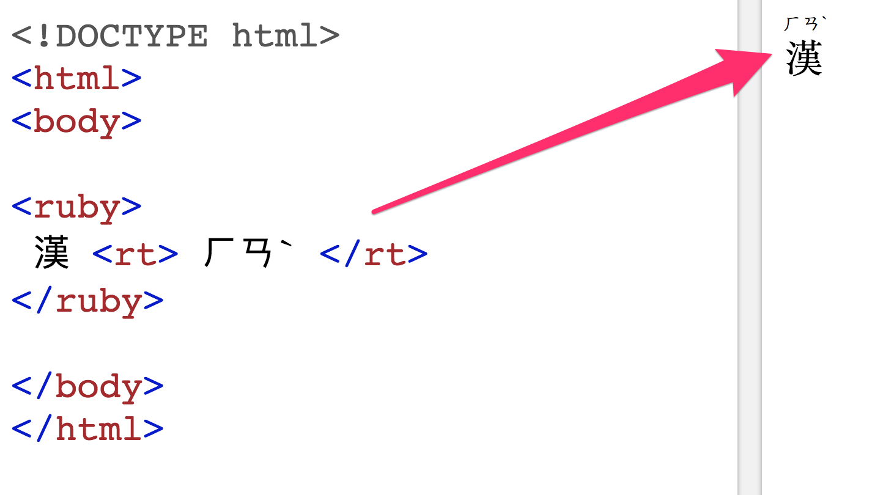
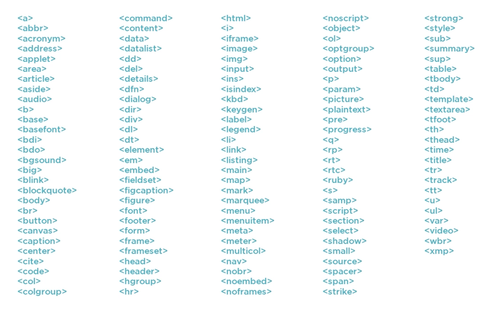
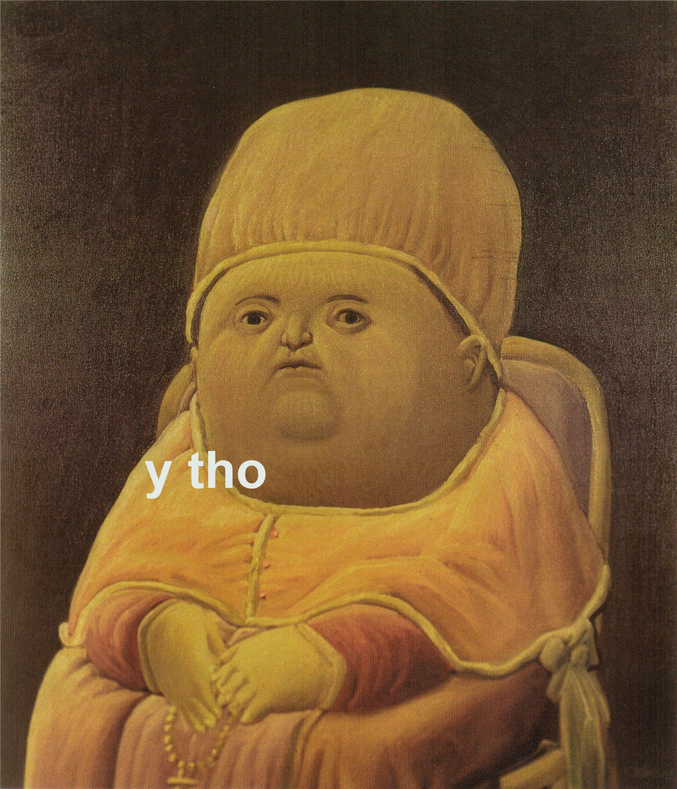
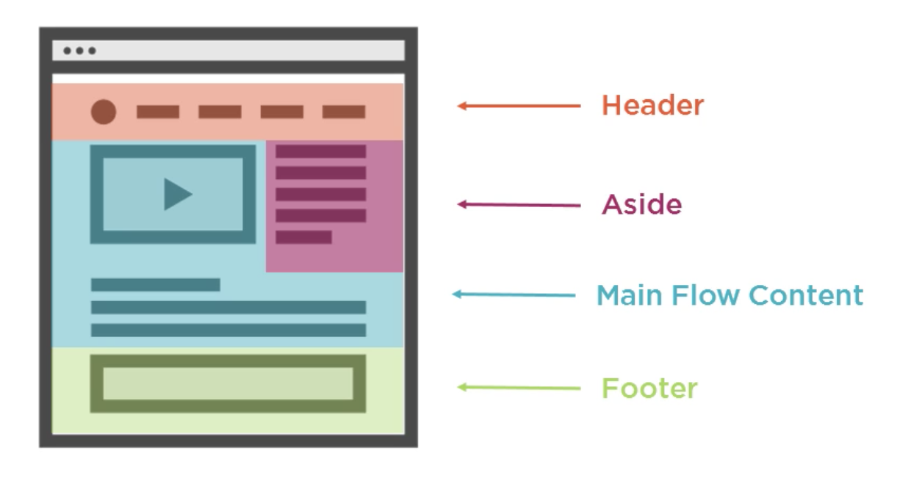
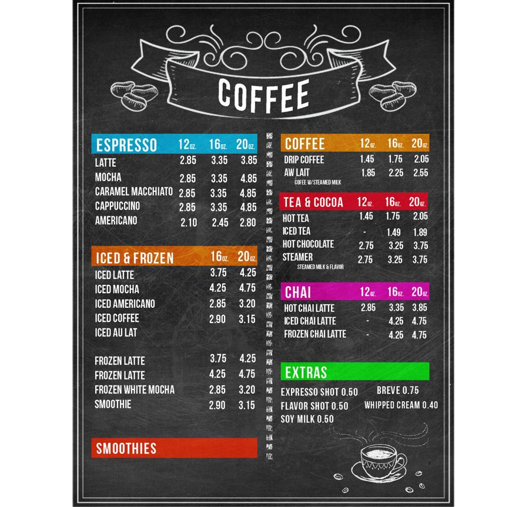
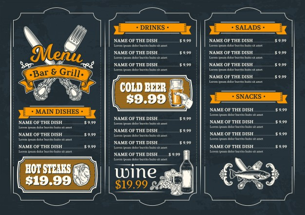
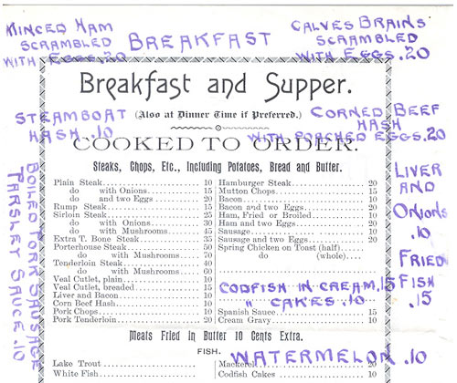

export { default as theme } from '../src/wizeline-theme'
import { CodeSurfer } from "mdx-deck-code-surfer"
import { Notes } from 'mdx-deck'

import {WSlideMain, WSlide2, WSlide3, WSlide4, WSlide5, WSlideThankyou} from "../src/wizeline-theme/slides"
import {WLayout1, WLayout2} from '../src/wizeline-theme/layouts'
import { Split } from 'mdx-deck/layouts'

import Counter from '../src/components/Counter'
import Codepen from '../src/components/Codepen'

<WSlideMain
  subtitle=""
  title="Semantic HTML"
/>
---
<WSlide2
  title="Content"
  title2=""
  content1="What is Semantic HTML?"
  content2="Where and how should I use it?"
  content3="Common tags"
  content4="Accessibility & Tooling"
/>
---
<WSlide3
  title="What is Semantic HTML?"
/>
---
export default WLayout1

# Semantic HTML
### is HTML that introduces meaning to the web page rather than just presentation

---
export default WLayout1

# Let's make a
## quick excercise
---
export default WLayout2

<CodeSurfer
  title="How many do you recognize?"
  code={require("!raw-loader!./snippets/tags.html")}
  lang="html"
  showNumbers={false}
  dark={false}
  steps={[
    { range: [3, 10] },
    { lines: [13] },
    { lines: [14] },
    { range: [15, 17] },
    { range: [18, 22] },
    { range: [25, 27] },
    { range: [29, 34] },
    { lines: [32], notes: `this one doesn't exists, probably you where thinking of <aside>` }
  ]}
/>
<Notes>
  Raise your hand if you knew less than 20%... more than half... all of these tags!

  Well... one of those doesn't exist.
</Notes>
---

<Notes>
  Fun fact for the people that thought it was the ruby tag.

  It actually is used mostly in japanese, it attaches an anottation to indicate
  the pronunciation or meaning of the corresponding characters.
</Notes>
---
export default WLayout1

# There are a lot of HTML tags

<Notes>
  And when I mean a lot, I mean it
</Notes>
---

---
<WSlide3
  title="Where should I use them?"
/>
---
export default WLayout1

# Short answer
---
export default WLayout1

## When it gives us a better context
## on the data that it contains
---
export default WLayout1

<CodeSurfer
  title="Looks good, right?"
  code={require("!raw-loader!./snippets/non-semantic-footer.html")}
  lang="html"
/>
---
export default WLayout1

<CodeSurfer
  title="Much better!"
  code={require("!raw-loader!./snippets/semantic-footer.html")}
  lang="html"
/>

---
export default WLayout1

---
export default WLayout1

### To provide more information about the contents,
## useful for...
### Humans
### Machines
### Machines that help humans

---
<WSlide3
  title="Most used tags"
/>
---
export default WLayout1

`div`
#### A semantically meaningless element used to group
#### elements toghether for styling purposes
---
export default WLayout1

`header`
#### represents introductory content, typically a group
#### of introductory or navigational aids
---
export default WLayout1

`main`
#### represents the dominant content of the `<body>` of a document

---
export default WLayout1

`aside`
#### Represents a portion of a document whose content
#### is only indirectly related to the document's main content
---
export default WLayout1

`footer`
### contains information about the author of the section,
### copyright data or links to related documents
---

---
export default WLayout1

`nav`
#### represents a section of a page whose purpose is to provide navigation links,
#### either within the current document or to other documents
---
export default WLayout1

`article`
#### represents a self-contained composition in a document, page, application, or site,
#### which is intended to be independently distributable or reusable
---
export default WLayout1

`section`
#### represents a self-contained composition in a document, page, application, or site,
#### which is intended to be independently distributable or reusable
---
export default WLayout1

## More info at:
<a href="https://developer.mozilla.org/en-US/docs/Web/HTML/Element" target="_blank">
  https://developer.mozilla.org/en-US/docs/Web/HTML/Element
</a>
---
export default WLayout1

## My site looks like
## it is NOT semantic
# How can I make sure my site becomes semantic?
---
export default WLayout1

# Auditing your page
### Read your HTML code like you where
### reading a menu of a restaurant or a coffee shop

---
export default Split

### Hierarchy
### Well defined sections

---
export default Split

### It can be more complex
### Even different styled elements
### are in their semantic section

---
export default WLayout1

### This is how it feels when you read a
### non semantic HTML code
---
export default Split

### No Hierarchy
### Confusing sections
---
# 3 signs that your site
## needs to be pimped

- The elements are too generic
- Using semantic tags for styling purposes
- Site structure differs from planned

---
<WSlide4
  title="Practice time"
/>
---
<WSlide3
  title="Accesibility & tooling"
/>
---

  <a href="https://chrome.google.com/webstore/detail/chromevox/kgejglhpjiefppelpmljglcjbhoiplfn" target="_blank">
    <h2>ChromeVox</h2>
  </a>

  <a href="https://chrome.google.com/webstore/detail/html5-outliner/afoibpobokebhgfnknfndkgemglggomo" target="_blank">
    <h2>HTML5 outliner</h2>
  </a>

---
<WSlideThankyou/>
