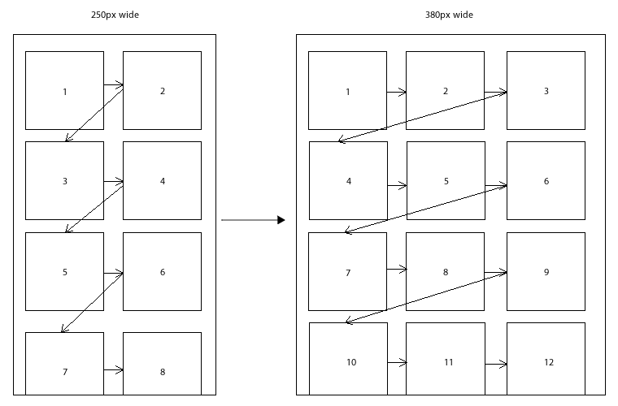
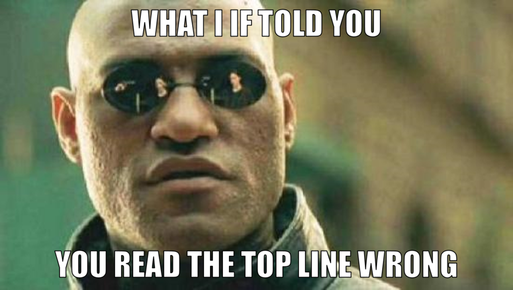
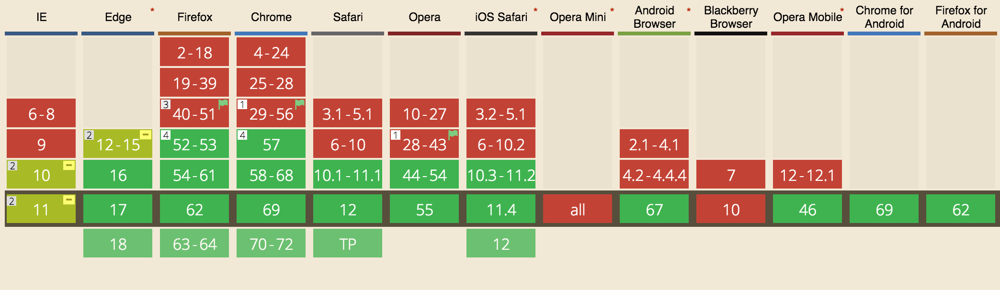
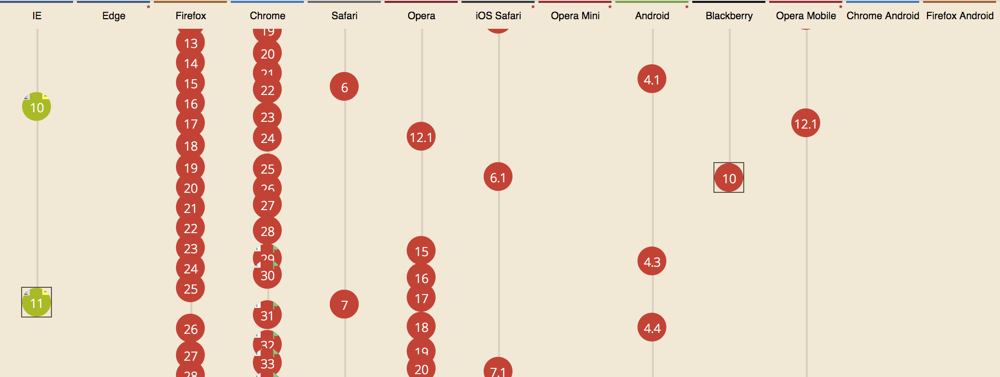

export { default as theme } from '../src/wizeline-theme'
import { CodeSurfer } from "mdx-deck-code-surfer"
import { Notes, Appear } from 'mdx-deck'

import {WSlideMain, WSlide2, WSlide3, WSlide4, WSlide5, WSlideThankyou} from "../src/wizeline-theme/slides"
import {WLayout1, WLayout2} from '../src/wizeline-theme/layouts'

import Counter from '../src/components/Counter'
import Codepen from '../src/components/Codepen'


<WSlideMain
  subtitle=""
  title="Layout with CSS"
/>

---

<WSlide2
  title="Content"
  content1="Positioning (position and float)"
  content2="Stacking Context"
  content3="Flexbox"
  content4="CSS Grid"
/>

---

export default WLayout1

# Positioning

The `position` attribute.

---
<CodeSurfer
  title="Static"
  code={require("!raw-loader!./snippets/static.css")}
  lang="css"
  showNumbers={false}
  dark={false}
/>

<Notes>
  The default from browsers
</Notes>

---

<Codepen url="https://codepen.io/TheMightyPenguin/pen/YJZVwy" />

---

<CodeSurfer
  title="Relative"
  code={require("!raw-loader!./snippets/relative.css")}
  lang="css"
  showNumbers={false}
  dark={false}
/>

<Notes>
  Starts just as static if we use it alone.
  But if we use positioning properties, the magic happens.
</Notes>

---

<Codepen url="https://codepen.io/TheMightyPenguin/pen/YJZVwy" />

---
export default WLayout1

Will react to the following properties:

* `top`
* `bottom`
* `left`
* `right`
* `z-index`

---

<CodeSurfer
  title="Absolute"
  code={require("!raw-loader!./snippets/absolute.css")}
  lang="css"
  showNumbers={false}
  dark={false}
/>

<Notes>
  The element will not remain in the natural flow of the page.
  It will position itself according to the closest positioned ancestor
</Notes>

---
export default WLayout1

The element will position itself according to the closest positioned ancestor

---

<Codepen url="https://codepen.io/TheMightyPenguin/pen/YJZVwy" />

---

<CodeSurfer
  title="Fixed"
  code={require("!raw-loader!./snippets/fixed.css")}
  lang="css"
  showNumbers={false}
  dark={false}
/>

<Notes>
  The element will not remain in the natural flow of the page.
  It will position itself according to the viewport.
</Notes>

---

The element will position itself according to the viewport

---

<Codepen url="https://codepen.io/TheMightyPenguin/pen/YJZVwy" />

---
export default WLayout1

# Exercise Time!!

---

<Codepen url="https://codepen.io/TheMightyPenguin/full/OBOzXx/" />

---

<Codepen url="https://codepen.io/TheMightyPenguin/pen/PyOEmO" />

---
export default WLayout1

# Floats

<Notes>
  Floated elements remain a part of the flow of the web page.
  This is distinctly different than page elements that use absolute positioning.
  Absolutely positioned page elements are removed from the flow of the webpage.
</Notes>

---
export default WLayout1

Floats let us stack things horizontally instead of vertically

---


---

<Codepen url="https://codepen.io/TheMightyPenguin/pen/GYmMpp" />

---

<Codepen url="https://codepen.io/TheMightyPenguin/pen/oaZwJq" />

<Notes>
  Explain what happens with floats, that they dont affect the height of their parent.
</Notes>

---
export default WLayout1

“Clearing” a float is when we tell a block to ignore any floats that appear before it.

<Notes>
  “Clearing” a float is when we tell a block to ignore any floats that appear before it.
  Instead of flowing around the floated box, a cleared element always appears after any floats.
  It’s like forcing a box back into the default vertical flow of the page.
</Notes>

---

<Codepen url="https://codepen.io/TheMightyPenguin/pen/oaZwJq" />

---
export default WLayout1

# Stacking Context

<Notes>
  Explain that it not only happens with `z-indez` but also with
  other properties, but it's commonly found of when using z-index.
</Notes>

---

<Codepen url="https://codepen.io/TheMightyPenguin/pen/ZqKopB" />

<Notes>
  To begin with, boxes will be stacked following the normal flow of the page.
  That means, the order they were used in the HTML.

  Each stacking context is self-contained: after the element's contents are stacked,
  the whole element is considered in the stacking order of the parent stacking context.
</Notes>

---

Stacking Context are created when an element:
* Is the root element of a document (the `<html>` element)
* Is positioned and a `z-index` value other than `auto`
* Has an opacity value less than 1
* ..... (Check MDN reference for a complete list)

---

<CodeSurfer
  title="Managing z-index"
  code={require("!raw-loader!./snippets/zindex.css")}
  lang="css"
  showNumbers={false}
  dark={false}
  steps={[
    { range: [1, 3] },
    { range: [1, 7] },
    { range: [1, 9999] },
  ]}
/>

---

<CodeSurfer
  title="Bootstrap"
  code={require("!raw-loader!./snippets/zindex-bootstrap.scss")}
  lang="scss"
  showNumbers={false}
  dark={false}
/>

---

<CodeSurfer
  title="z-index Map"
  code={require("!raw-loader!./snippets/z-index_map.scss")}
  lang="scss"
  showNumbers={false}
  dark={false}
  steps={[
    { range: [1, 13] },
    { range: [16, 21] }
  ]}
/>

---

<CodeSurfer
  title="Naming Convetions for z-index"
  code={require("!raw-loader!./snippets/layers.css")}
  lang="css"
  showNumbers={false}
  dark={false}
/>

---

# Flexbox

<Notes>
  Flexbox is (aside from optional wrapping) a single-direction layout concept
</Notes>

---

<Codepen url="https://codepen.io/TheMightyPenguin/pen/mzmLGZ" />

---

# Flexbox Properties

* `justify-content`: Positions items on the main-axis (horizontal or row by default)
* `align-items`: Positions items on the cross-axis (vertical or column by default)
* `flex-direction`: Swaps the main and cross axes (row by default)
* `flex-wrap`: Should the items jump to the next line?

---

# Flexbox Properties

* `flex-grow`: Prioritizes what elements to grow
* `flex-shrink`: Should the element shrink or not?
* `flex-basis`: Initial size (width on row, height on column)
* `flex`: `flex-grow flex-shrink flex-basis`

---

# Flexbox Properties

Complete list with values at: https://css-tricks.com/snippets/css/a-guide-to-flexbox/

---

# Exercise Time!!

<Notes>
  Note: in case both flex-basis (other than auto)
  and width (or height in case of flex-direction: column)
  are set for an element, flex-basis has priority.
</Notes>

---

<Codepen url="https://codepen.io/TheMightyPenguin/full/jewwWp/" />

---

<Codepen url="https://codepen.io/TheMightyPenguin/pen/bmRROQ" />

---

### 1 dimensional flow

<Notes>
  We've been talking about HTML and CSS for 3 sessions now,
  an we understand how it "flows".
  Technically is like an array that starts filling the space
  in our page, right?
</Notes>
---


<Notes>
  Well it is time to wake up!
</Notes>

---

<Notes>
  It's time to take the red pill and get to know...
</Notes>
---

# CSS grid

<Appear>
  <h2>a 2-dimensional layout system</h2>
</Appear>
<Notes>
  You might be thinking: this sound like something from the future
  Can we use it now?
</Notes>
---
## Support


<Notes>
  Yes, al modern browsers support it. And even internet explorer 11
  has support for most of the specification. It is in a different color
  because, as you might know, it stopped getting updates.
  So basically it is stuck with an old implementation.
  As usual IE is lagging behind, am I right?
</Notes>
---

<Notes>
  Wrong, actually IE was the first browser to start it's implementation.
  MS was the one pushing for its standarization and adoption.
</Notes>
---
# Terminology
<Notes>
  Before we continue we need to sync with some terminology
</Notes>
---
# line

<Notes>
  Lines are the kind of imaginary lines dividing the grid, either horizontally or vertically
</Notes>
---
# track

<Notes>
  A track isis the space between two lines, it can be either a row or column
</Notes>
---
# cell

<Notes>
  The cell is pretty self explanatory, a single unit in the grid
</Notes>
---
# area

<Notes>
  The space between 4 lines, basically a rectangle that contains more than one cell
</Notes>
---
# How can I get started with CSS grid?

---
### Three simple things
<Appear>
  <p><code>display: grid;</code></p>
  <p><code>grid-template-columns: 12px 12px 12px;</code></p>
  <p><code>grid-template-rows: 12px 12px 12px;</code></p>
</Appear>
---
<Codepen url="https://codepen.io/ederdiaz/pen/PyRjRv" />

---
## Quick recap
```
.parent {
  display: grid;
  grid-template-columns: 2fr 1fr;
  grid-template-rows: 100px auto;
  grid-gap: 1px 9px;
}
```
---
## Quick recap
```
.child {
  grid-column-start: 1;
  grid-column-end: 3;
  grid-row: 1 / span 2;
  grid-area: header;
}
```
---
<a href="http://grid.malven.co/" target="_blank">
  <h2>Cheat sheet</h2>
</a>

<Notes>
  If you forget something or want to know the rest of the properties
  you can check this cheatsheet
</Notes>
---

<WSlideThankyou />
