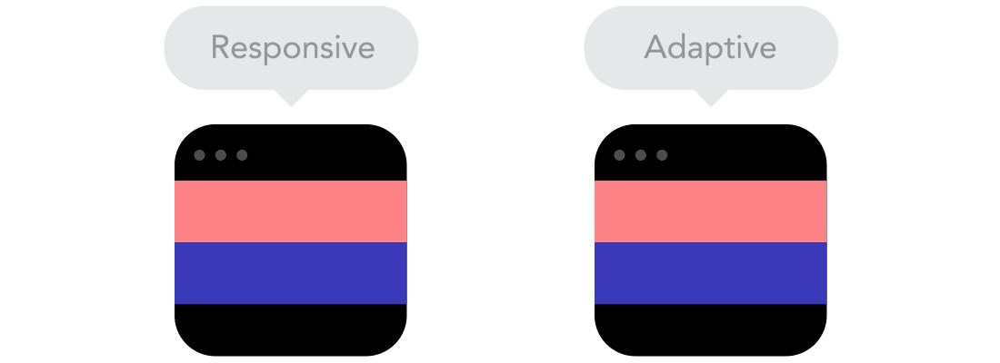

import { CodeSurfer } from "mdx-deck-code-surfer"
import { Notes, Appear } from 'mdx-deck'
import { Split } from 'mdx-deck/layouts';

import {WSlideMain, WSlide2, WSlide3, WSlide4, WSlide5, WSlideThankyou} from "../src/wizeline-theme/slides"
import {WLayout1, WLayout2} from '../src/wizeline-theme/layouts'

import Codepen from '../src/components/Codepen'

<WSlide3 title="Responsive Design Patterns" />

---

# Responsive VS Adaptive

<Notes>
  Ask they audience if someone knows what's responsive Design
  and also ask if they know adaptive, and the differences
</Notes>

---

<Notes>
  One way to see it could be as smooth vs snap
</Notes>

---

<Notes>
  Note that the Adaptive one only looks good
  on certain resolutions
</Notes>

---

# http://www.liquidapsive.com/

<Notes>
  Adaptive web design uses distinct layouts for multiple screen sizes,
  the layout largely depends on the screen size being used so with each
  of these sizes in mind a layout would have to be designed for it.

  Response web design adapts to the size of the screen no matter what
  the target device screen size is. The layout is ‘fluid’ and uses
  CSS media to change styles, this ‘fluid’ grid enables the page
  to resize its width and height to adapt to different screen
  sizes and show correctly.
</Notes>

---

## Responsive:
  * https://dev.to/
  * https://modernizr.com/
  * https://spectrum.chat

---

## Adaptive
* http://www.usatoday.com/
* https://twitter.com

<Notes>
  Showcase examples of real sites using responsive and adaptive
</Notes>

---

# In short

## Responsive: Looks good on all resolutions
## Adaptive: Optimized for fixed resolutions

<Notes>
  Adaptive web design uses distinct layouts for multiple screen sizes,
  the layout largely depends on the screen size being used so with each
  of these sizes in mind a layout would have to be designed for it.

  Response web design adapts to the size of the screen no matter what
  the target device screen size is. The layout is ‘fluid’ and uses
  CSS media to change styles, this ‘fluid’ grid enables the page
  to resize its width and height to adapt to different screen
  sizes and show correctly.
</Notes>

---

# When to use one or the other?

<Notes>
  It depends on how much the design changes from one breakpoint
  to another, if it changes a lot, adaptive makes more sense.
  but nowadays is more common to go with responsive design,
  as it'll cover more devices.

  We'll be focusing on responsive design, as that is
  what's mostly used today, and for the project you'll
  have to use it.
</Notes>

---

<WSlide3
  title="Questions ?"
/>

---

### https://bradfrost.github.io/this-is-responsive/patterns.html

---

# Using a Framework Grid

<Notes>
  Lets talk about Grids. Is a common pattern when implementing
  a responsive design. Lets take a look to the Bootstrap grid
  as an example. This is not the same as CSS Grid. We wont be going
  too deep into this. Designers will usually give designs with a grid
  aligned.
</Notes>

---

<Codepen url="https://codepen.io/TheMightyPenguin/pen/gBjVyJ" />

<Notes>
  https://getbootstrap.com/docs/4.0/layout/grid/
</Notes>

---

# References

* https://bradfrost.github.io/this-is-responsive/patterns.html
* https://developers.google.com/web/fundamentals/design-and-ux/responsive/patterns
