export { default as theme } from '../src/wizeline-theme'
import { CodeSurfer } from "mdx-deck-code-surfer"
import { Notes } from 'mdx-deck'

import {WSlideMain, WSlide2, WSlide3, WSlide4, WSlide5, WSlideThankyou} from "../src/wizeline-theme/slides"
import {WLayout1, WLayout2} from '../src/wizeline-theme/layouts'
import { Split } from 'mdx-deck/layouts'

import Counter from '../src/components/Counter'
import Codepen from '../src/components/Codepen'

<WSlideMain
  subtitle=""
  title="JS Objects and Prototypes"
/>
---
<WSlide2
  title="Content"
  title2=""
  content1="Objects - quick overview/reminder"
  content2="JS Functions"
  content3="OO JS tweaks (inheritance mechanism aka Prototype)"
  content4="JS classes"
/>
---
<WSlide3
  title="Have you ever truly worked with JS?"
/>
---

<Notes>
  JS is an often disliked language because it "allows you to write very ugly code 
  and have a lot of bad practices. It also has weird behavior and async programming issues."
  We can agree on that. But if you get to know the language and the basics of its behavior,
  you can also write very clean and easy to maintain code.
</Notes>

---
export default WLayout1

# Objects in JS - quick overview/review.

<Notes>
  We'll have a quick reminder of the basics of JS objects.
</Notes>
---
export default WLayout1

# JS as an OO language.
### JS does not have classes like typical OO languages do.
### "In JS everything, everything is an object".

<Notes>
  JS does not have classes like typical OO languages do, but does this
  mean JS it not OO?

  How many of you have heard that "in JS everything is an object"?.
</Notes>
---
export default WLayout1

# Actually...
### In JS everything, except primitives, is a ready-to-use object or a subtype of it.

<Notes>
  Primitives are not objects, however there is an object equivalent for primitives.
  Which allows you to do something like the following:
</Notes>
---
export default WLayout2

<CodeSurfer
  title=""
  code={require("!raw-loader!./snippets/primitive-obj-equivalent.js")}
  lang="js"
  showNumbers={false}
  dark={false}
  steps={[
    { lines: [1] }
  ]}
/>
<Notes>
  'hello' is a string primitive, but internally the JS engine coerces them to their object
  primitive equivalent. With that in mind, let's move on to the object creation basics.
</Notes>
---
export default WLayout1

# So...
## If we don't have classes, how do we create an object?
### Take a look at the literal notation...

<Notes>
  If we don't actually have classes in JS, how do we create an object?
  Take a look at the called literal notation. 
  IMPORTANT: Please keep in mind that at this point we are not
  dealing with inheritance for now.
</Notes>
---
export default WLayout2

<CodeSurfer
  title=""
  code={require("!raw-loader!./snippets/obj-literal-notation.js")}
  lang="js"
  showNumbers={false}
  dark={false}
  steps={[
    { lines: [2], notes: `This is a property` },
    { lines: [3,4,5], notes: `This is a method` },
    { lines: [6,7,8], notes: `This is another way of declaring a method` }
  ]}
/>
<Notes>
  Objects in JS look like key-value maps, like dictionaries in python.
  Does this notation remind you of anything you've worked with?
  Right! JSON.
  JSON actually stands for JavaScript Object Notation.
</Notes>
---
export default WLayout1

# Now, let's see the "constructed" way.

<Notes>
  Please keep in mind that this is just an alternative, but the
  literal notation is preferred.
</Notes>
---

export default WLayout2

<CodeSurfer
  title=""
  code={require("!raw-loader!./snippets/obj-constructed-notation.js")}
  lang="js"
  showNumbers={false}
  dark={false}
  steps={[
    { lines: [1], notes: `Create a plain object` },
    { lines: [2], notes: `Assign a property to it` },
    { lines: [3,4,5], notes: `Methods can be assigned as properties` }
  ]}
/>
<Notes>
  Did you notice the `new` operator there? It is used when you use
  "functions as constructors", it should not be confused with
  class instantiation. But we'll get to it later.
  Again, this is not preferred over the literal notation, but you can
  use it, if you want.
</Notes>

---
<WSlide3
  title="Now, a quick quiz to test your JS knowledge..."
/>

<Notes>
  Show the case 0 of file 'general' to explain how objects are passed by
  reference.
</Notes>
---
export default WLayout1

# In JS, objects are passed by reference.
---
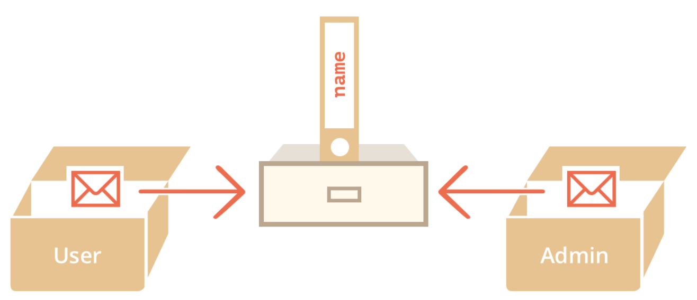

<Notes>
  This is a graphical representation of what we just
  did. You can see that the object itself is stored
  somewhere in memory, and assigning it to variables
  will just make those variables point to where that object is stored. Modifying it thru one of the variables will make the rest have the same change.
</Notes>
---

export default WLayout1

## So then, how do we copy and create an independent object?
### With Object.assign()

<Notes>
  Show the code to demonstrate Object.assign()
</Notes>

---

<WSlide3
  title="Functions in JS"
/>

<Notes>
  We won't talk about how to run functions, but we'll demonstrate how functions in JS have object-like behavior too.
</Notes>

---

export default WLayout1

### Functions are "first-class" citizens. They can be passed around as any other object, and they have an internal property that allows them to be called.

<Notes>
  Show them the code of the function wrapper.
</Notes>

---

export default WLayout1

### So, if functions are objects, can we assign properties to them?

<Notes>
  Show them the code of the function with props.
</Notes>

---
export default WLayout1

### YES! Functions in JS can be assigned properties and methods like any other object.

<Notes>
  Please keep in mind this feature of functions in JS, because it's a key aspect of how the inheritance mechanism in JS works.
</Notes>

---

export default WLayout1

## Some highlights before we move on
- Objects are passed by reference.
- We haven't created any "class", yet we have already worked with objects.
- Functions can behave like objects.

<Notes>
  These are the 3 key aspects that you need to keep in mind to fully understand how inheritance works.
</Notes>

---

export default WLayout1

### So, if we don't have classes in JS, is it an OO language?

<Notes>
  Let the audience express their opinions.
</Notes>

---

<WSlide3
  title="JS OO tweaks"
/>

<Notes>
  Throw question. If JS doesn't have classes, how does it handle inheritance?
</Notes>

---
export default WLayout1

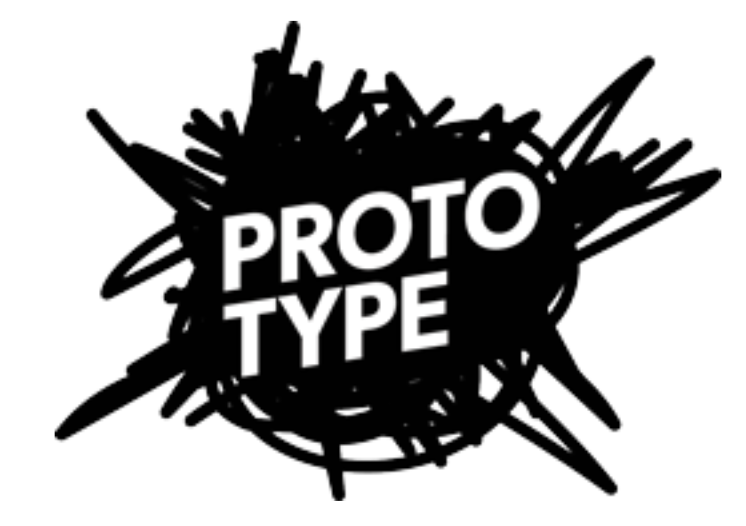

<Notes>
  We'll now see what prototype is and how it behaves as the mechanism for inheritance.
</Notes>

---

export default WLayout1

`[[ Prototype ]]`
### It is a hidden property of every object. It points to another object.
### But before going in depth, a quick quiz...

<Notes>
  Show them the case 0 of prototype file.
</Notes>

---

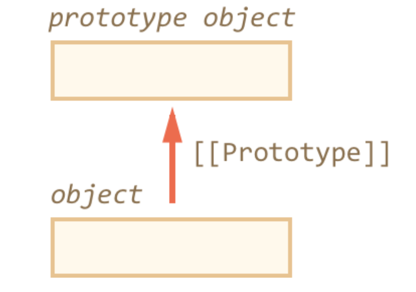

<Notes>
  Object.create() creates a new object, and the resulting object is prototype-linked to the base object.

  We have the called 'prototype chain', which is the way to search for props in case an object doesn't have one.
  
  If the end of the chain is reached, the prop is considered `undefined`.
</Notes>

---

export default WLayout1

### Time for the mainstream animal -> rabbit -> specific rabbit example!

---

export default Split

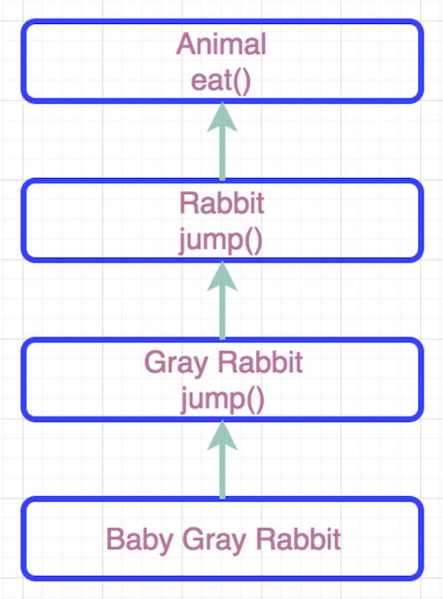

- An animal can eat, but can't jump.
- A rabbit can eat like an animal, and jump like a rabbit.
- A gray rabbit can eat like an animal, and jump like a gray rabbit.
- A baby gray rabbit can eat like an animal, and jump like a gray rabbit.

<Notes>
  If the requested prop/method is not found on the current object, it's searched on the prototype chain and the search is considered done at the first occurence of the prop.

  Please note that all of the objects in the chain can be executed.
</Notes>

---

export default WLayout1

`Behavior Delegation`
#### If an object doesn't have a property or method, it tells its prototype to execute/access it if it does have it.

<Notes>
  The reason why it's called behavior delegation is because if an object doesn't have a property or method, it asks its prototype, which is an object too, to execute or access it, thus delegating the operation to someone else.
</Notes>

---

export default WLayout1

### Can a child object modify its parent's properties, thus affecting the rest of its siblings? Let's see...

<Notes>
  Show them the code for this scenario.
</Notes>

---

export default WLayout1

### If a change to a property that the object doesn't have is required, the engine first creates the prop on the specific object and then modifies it.

<Notes>
  This is in order to protect other siblings from unexpected changes.
</Notes>

---

<WSlide3
  title="Typical class inheritance vs behavior delegation."
/>

---

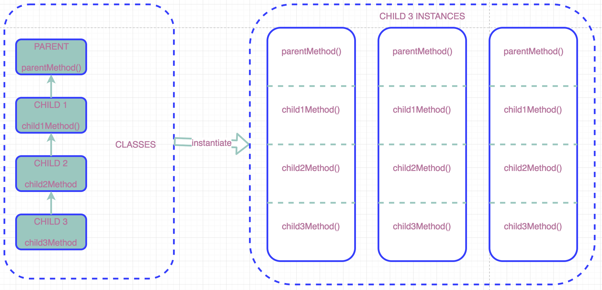

<Notes>
  Explain how objects are bigger in size because they copy the behavior from the parent classes in all the inheritance chain.
</Notes>

---

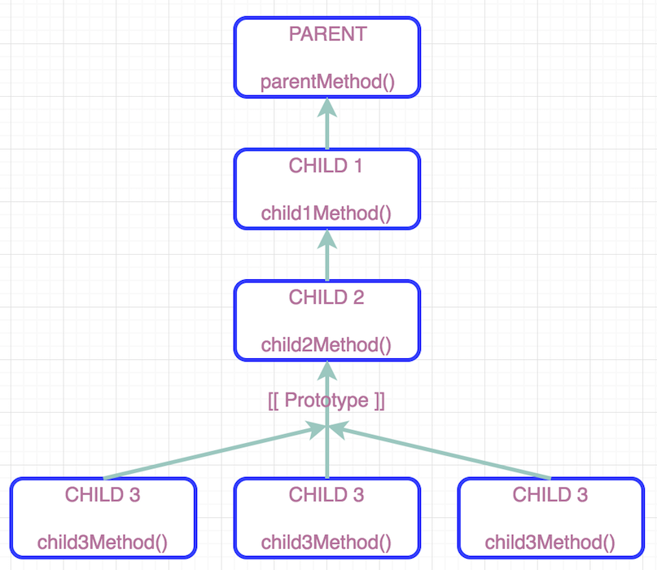

<Notes>
  Explain how this mechanism is more efficient from memory point of view, because all parent's functionality is not copied over to its children.
</Notes>

---

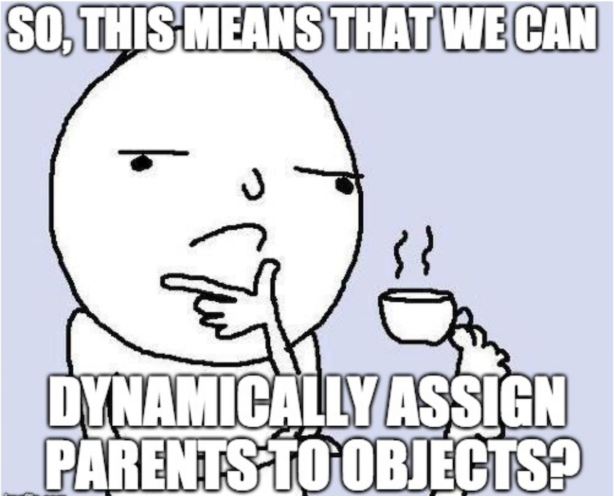

<Notes>
  If behavior is delegated rather than inherited, does it mean that we can dynamically choose whom to delegate the behavior to?

  Show them the citizen example
</Notes>

---

export default WLayout1

### YES! But be aware that this is a slow operation.

<Notes>
  Explain that it's up to the engine designers to optimize the operation,
  but, as a rule it's considered a slow operation.
</Notes>

---

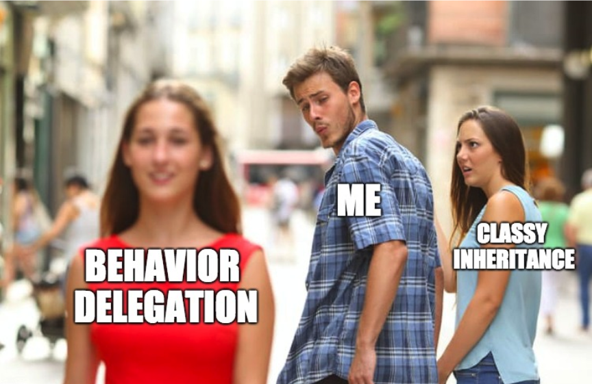

---

## Exercise time!

### Animal -> Bird -> specific birds
- Birds can fly
- An eagle can fly
- An ostrich cannot fly but can run
- A penguin cannot fly but can swim

---

<Codepen url="https://codepen.io/orverduzco/pen/NOeYBb"/>

---

<WSlide3
  title="Object creation revisited"
/>

<Notes>
  This time with inheritance.
</Notes>

---

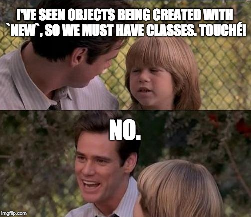

---

export default WLayout1

## Functions as constructors.
### You can use functions to create objects. Let's take a look at an example

<Notes>
  File: prototype, case 4
</Notes>

---

export default WLayout1

## What happens when you create an object using a function?
- A context is created where `this` is the object to be returned.
- In the function body you can assign props and/or methods to `this`.
- At the end, the value of `this` (an object) is returned. Note that no `return` statement is required for this to happen.

<Notes>
  - A context is created where `this` is the object to be returned.
  - Ideally, you use the function body to assign properties and methods to `this`.
  - At the end, the value of `this` (an object) is returned. Note that no `return` statement is required for this to happen.
</Notes>

---

export default WLayout1

## So, what happens to behavior delegation when you build objects using functions?
### Let's have a quick 2-parts quiz...

<Notes>
  Show them quiz part 1 and ask them what the difference is between the 2 scenarios if at the end the result is the same.

  Then, show them quiz part 2 and highlight the behavior where the constructed animal can jump, while the other can't.
</Notes>

---

<Notes>
  - Explain how all functions have a public property called `prototype`.
  - Objects built with functions as constructors point their internal `[[Prototype]]` prop to the public `prototype` prop of the function, thus delegating behavior to the function as an object, no to the function as a callable.
</Notes>

---

export default WLayout1

## Why is this public `prototype` property even important?
- It's the behavior delegation mechanism for functions as constructors.
- Polyfills. We'll see an example.
- JS classes (we'll get into this).

<Notes>
  - The behavior delegation mechanism was already explained.
  - Polyfills are a way to dynamically 'fill' functionality that is not there on parents.
  - Show them the example of polyfill and come back to this slide.
  - Explain that polyfills are the mechanism that a lot of transpilers use to compensate for functionality not present on old browsers.
  - Jump to JS classes.
</Notes>

---

export default WLayout1

## Exercise time! 
### Same exercise as before but now with functions as constructors.

---

<Codepen url="https://codepen.io/orverduzco/pen/JmwZgp"/>

---

<WSlide3
  title="JS classes"
/>

---

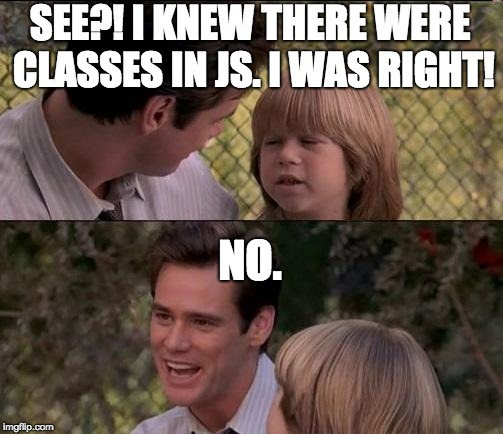

---

export default WLayout1

## Classes in JS are just "syntactic sugar".
### Let's see the syntaxis...

<Notes>
  Classes probably were added because the JS team wanted to join the OO trend and keep their devs happy. But they are a good thing, just be aware that they are not like the typical OO languages classes.

  Show them what the syntaxis is with file classes case 0.

  So, if they are not like the typical classes, what are they?
</Notes>

---

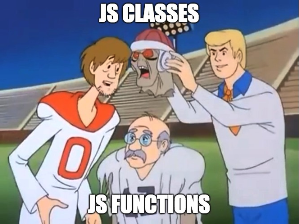

---

export default WLayout1

## What happens when a class is declared?
- A function with that name is created.
- All the properties assignments through `this.<prop>` on the constructor are put into the function's body.
- All the methods declared in the class are assigned as methods to the function's `prototype` property.

<Notes>
  - Show the example on file classes, case 1.
</Notes>

---

export default WLayout1

## Can we have static methods?
### Yes, but they are assigned as properties to the function object, rather than to its `prototype`.

<Notes>
  Show them file classes, case 2.

  This way you can simulate a call to the class' static methods, but in reality you're just accessing an object's property.
</Notes>

---

export default WLayout1

## Classes extending other classes.
### Let's take a look at the internal mechanism for this.

<Notes>
  Show classes file, case 3.
</Notes>

---

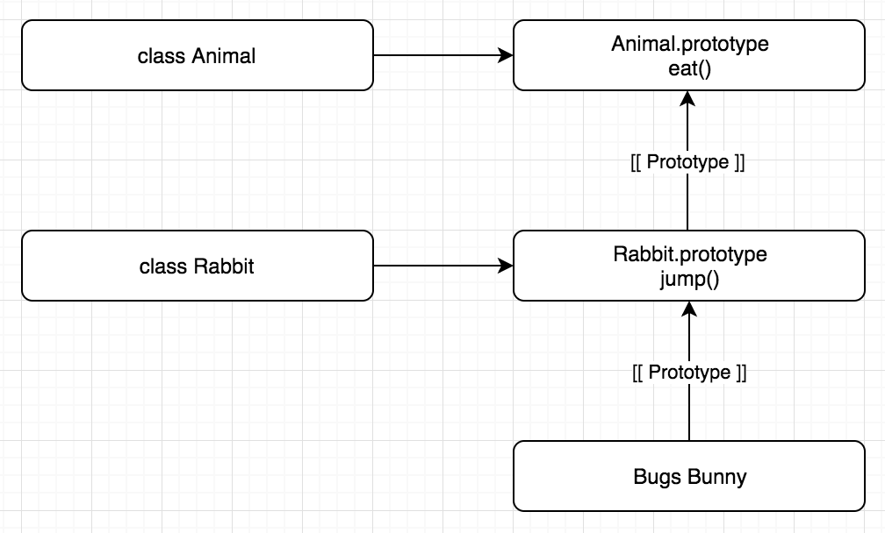

<Notes>
  To understand this, we need to make a clear distinction between `prototype` and `[[Prototype]]`

  Explain that what actually happens is that, when a class extends another class, its underlying function's `property` object, whih is an object and thus has `[[Prototype]]`, points its `[[Prototype]]` to another function's `prototype`
</Notes>

---

export default WLayout1

## Exercise time!
### Same, but with classes.

---

<Codepen url="https://codepen.io/orverduzco/pen/QZzBpE"/>

---

<WSlide3
  title="Recap"
/>

---

export default WLayout1

- Everything, except primitives, is a ready-to-use object.
- Functions are objects too and can be assigned properties and methods.

---

export default WLayout1

- All objects have a `[[Prototype]]` hidden property that points to another object.
- This property allows for Behavior Delegation.

---

export default WLayout1

- Functions can be used as object constructors.
- The resulting object has its `[[Prototype]]` property pointing to a public `prototype` property that all functions have (note that these 2 props are different).

---

export default WLayout1

- The fact that functions are objects too allows to mimic the behavior of classes by playing with their `prototype` public property.
- Classes are just syntactic sugar.

---

export default WLayout1

- Functions' `prototype` property also allows to mimic the behavior of classes extending other classes.

---

<WSlide3
  title="Q&A"
/>

---
<WSlideThankyou/>
