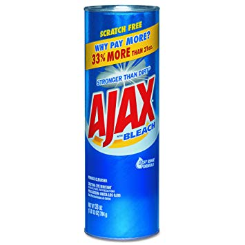

export { default as theme } from '../src/wizeline-theme'
import { CodeSurfer } from "mdx-deck-code-surfer"
import { Notes } from 'mdx-deck'

import {WSlideMain, WSlide2, WSlide3, WSlide4, WSlide5, WSlideThankyou} from "../src/wizeline-theme/slides"
import {WLayout1, WLayout2} from '../src/wizeline-theme/layouts'
import { Split } from 'mdx-deck/layouts'

import Counter from '../src/components/Counter'
import Codepen from '../src/components/Codepen'

<WSlideMain
  subtitle=""
  title="HTTP requests"
/>

---

# AJAX
<Notes>
  When we talk about HTTP request we have to talk abou AJAX,
  and I'm not referring to this...
</Notes>
---

---

---

<Notes>
  I'm talking about this...
</Notes>
---

## Asynchronous JavaScript And XML

---

### AJAX capabilities

- Read data from a web server after the page has loaded
- Update a web page without reloading the page
- Send data to a web server

---

# Using XHR
### XMLHttpRequest

---

<CodeSurfer
  title="XHR"
  code={require("!raw-loader!./snippets/xhr.js")}
  lang="js"
  showNumbers={false}
/>

---
# Using jQuery

---

<CodeSurfer
  title="$.ajax"
  code={require("!raw-loader!./snippets/jquery-ajax.js")}
  lang="js"
  showNumbers={false}
/>

---

<CodeSurfer
  title="$.get"
  code={require("!raw-loader!./snippets/jquery-get.js")}
  lang="js"
  showNumbers={false}
/>

---
# Using Axios

---

<CodeSurfer
  title="Axios"
  code={require("!raw-loader!./snippets/axios.js")}
  lang="js"
  showNumbers={false}
/>

---
# Using Fetch

---

<CodeSurfer
  title="Fetch"
  code={require("!raw-loader!./snippets/fetch.js")}
  lang="js"
  showNumbers={false}
/>

---
# When to use each one?
---
# XHR
#### Pros
- Supported by all browsers, even IE with partial support*
#### Cons
- Really verbose
- Difficult error handling

<Notes>
Partial support refers to not supporting json as responseType
</Notes>
---
# jQuery
#### Pros
- Supports all browsers
- Cleaner sintax
- Uses promises
#### Cons
- You need jQuery
---
# Axios
#### Pros
- Uses promises
- Works in the server too!
#### Cons
- Supports all browsers but needs promises polyfills
- Is a external library
---
# Fetch
#### Pros
- Uses promises
- Built in JS
#### Cons
- Client side only
- Not supported by IE11, needs polyfills
---

<WSlide3
  title="Q&A"
/>
