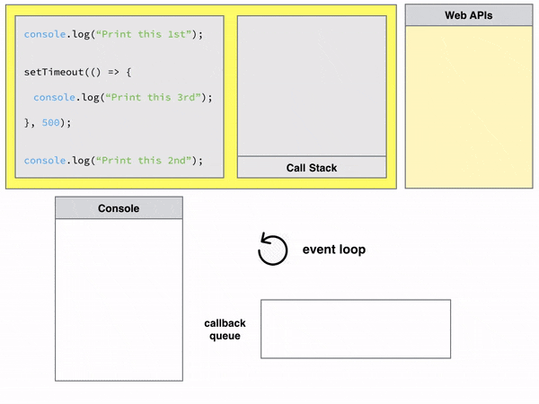
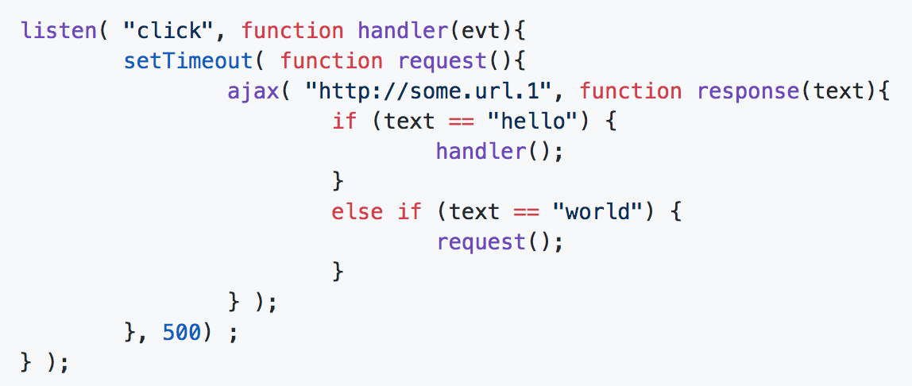
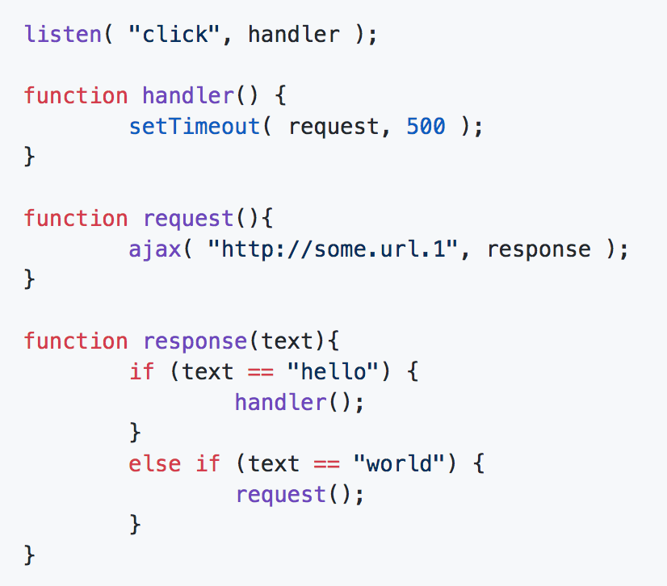
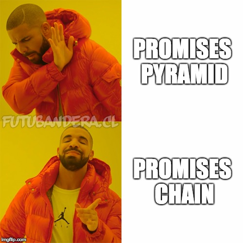

export { default as theme } from '../src/wizeline-theme'
import { CodeSurfer } from "mdx-deck-code-surfer"
import { Notes } from 'mdx-deck'

import {WSlideMain, WSlide2, WSlide3, WSlide4, WSlide5, WSlideThankyou} from "../src/wizeline-theme/slides"
import {WLayout1, WLayout2} from '../src/wizeline-theme/layouts'
import { Split } from 'mdx-deck/layouts'

import Counter from '../src/components/Counter'
import Codepen from '../src/components/Codepen'

<WSlideMain
  subtitle=""
  title="JS Async Programming"
/>

---

<WSlide2
  title="Content"
  title2=""
  content1="Event Loop"
  content2="Callbacks"
  content3="Promises"
  content4="Async/Await"
/>

---

<WSlide3
  title="What is the event loop?"
/>

---

export default WLayout1

# Quick quiz...

---

<Codepen url="https://codepen.io/orverduzco/pen/KGrYax"/>

---

---

export default WLayout1

# Event Loop.
### The event loop is the way the JS engine handles the execution of all the statements that need to go into the message queue. Don't worry, I'll explain this later.

---

## The runtime is composed by: 
- The call stack.
- The Heap
- The Queue
- The event loop

---

export default WLayout1

## The Heap: 
### It's a place in memory where objects are stored.

---

export default WLayout1

## The Call Stack: 
### It's where all the statements declared in the code are stacked and executed.

---

export default WLayout1

## The Queue: 
### It's where messages "to be processed" (aka async) go. 

---
export default WLayout1

## The Event Loop: 
### Everytime the Call Stack is emptied, the event loop checks the Queue and, if there are any messages pending to be processed, inserts them one by one into the call stack. 

---

---

export default WLayout1

http://latentflip.com/loupe/?code=JC5vbignYnV0dG9uJywgJ2NsaWNrJywgZnVuY3Rpb24gb25DbGljaygpIHsKICAgIHNldFRpbWVvdXQoZnVuY3Rpb24gdGltZXIoKSB7CiAgICAgICAgY29uc29sZS5sb2coJ1lvdSBjbGlja2VkIHRoZSBidXR0b24hJyk7ICAgIAogICAgfSwgMjAwMCk7Cn0pOwoKY29uc29sZS5sb2coIkhpISIpOwoKc2V0VGltZW91dChmdW5jdGlvbiB0aW1lb3V0KCkgewogICAgY29uc29sZS5sb2coIkNsaWNrIHRoZSBidXR0b24hIik7Cn0sIDUwMDApOwoKY29uc29sZS5sb2coIldlbGNvbWUgdG8gbG91cGUuIik7Cgo%3D!!!PGJ1dHRvbj5DbGljayBtZSE8L2J1dHRvbj4%3D

---

export default WLayout1

## Any ideas why it was designed to be like this?

---

export default WLayout1

# Non-blocking execution in the browser

---

export default WLayout1

## What are those `Web APIs` and how do they work?

---

- Not part of the JS spec.
- They interact with the broswer's hosting environment.
- Once done, they return to the JS runtime with a result and queue the callback with the result.

---

export default WLayout1

### `setTimeout()` is not part of the JS specification, but most runtime environments provide it as part of the API.

---

export default WLayout1

### What else did you notice in the `setTimeout` function?

---
export default WLayout1

### It is a higher order function, and it uses one of the mechanisms in JS to handle async operations.

---

<WSlide3
  title="Callbacks"
/>

---

export default WLayout1

## Quiz...
### How would you define a callback?
### Are callbacks async on their own?
### Let's see...

---

<Codepen url="https://codepen.io/orverduzco/pen/BqGEdJ"/>

---

export default WLayout1

### NO. Callbacks are just a way to indicate what to do whenever the real async operation is complete, nothing but a function passed as a parameter thanks to the ability to have higher order functions.

---

export default WLayout1

### Is there a way to make JS block the main (and only) thread? Let's see...
### (btw, JS is single-threaded.)

---

<Codepen url="https://codepen.io/orverduzco/pen/ZqmZBw"/>

---

export default WLayout1

### The JS engine executes your code in chunks, but all chunks are run to completion (unless interrupted).
### Can we use a callback to solve the previous problem? Let's see...

---

<Codepen url="https://codepen.io/orverduzco/pen/pxQBgZ"/>

---

export default WLayout1

### This varies between runtime environments, but generally, you can block the main thread using functions that take very long to execute. It's up to the environment to decide what to do.

---

export default WLayout1

### What is truly unblocking are the Web APIs. They are designed to interact with the hosting environment of the browser and make sure that they will execute in an efficient way, and always return a result.

---

export default WLayout1

### BE AWARE that it's up to you what to do with the callback. A Callback can block the main thread.

---

export default WLayout1

## Exercise time!
### Update the `img` with your Github's avatar using jQuery's `$.get(endpoint, callback)`

---

<Codepen url="https://codepen.io/orverduzco/pen/VERJqG"/>

---

# Error handling

- Silently ignored
- As part of the framework
- Error-first callbacks.

---

<Codepen url="https://codepen.io/orverduzco/pen/PygXrz"/>

---

<Codepen url="https://codepen.io/orverduzco/pen/rqbPQE"/>

---

<WSlide3
  title="Callback Hell"
/>

---

export default WLayout1

### Can someone tell me what the callback hell is?

---

<Codepen url="https://codepen.io/orverduzco/pen/PyxvMM"/>

---

export default WLayout1

### This is called the pyramid of doom. You can create a pyramid-like shape with all those nested callbacks.

---

export default WLayout1

### Is that all there is to the callback hell?

---

---

---

export default WLayout1

# Trust issues.

---

<Codepen url="https://codepen.io/orverduzco/pen/pxQMEO"/>

---

## Quick Recap

- Event loop - how async stuff is queued.
- Callbacks.
- Callback Hell.

---

<WSlide3
  title="Promises"
/>

---

export default WLayout1

## Who can tell me what a promise is?

---

export default WLayout1

### The `Promise` object represents the eventual completion (or failure) of an async operation, and its resulting value. Imagine a scenario where you order a burger.

---

<Codepen url="https://codepen.io/orverduzco/pen/JmVPJd"/>

---

export default WLayout1

### Purchase tracking scenario

---

<Codepen url="https://codepen.io/orverduzco/pen/KGYYjX"/>

---

export default WLayout1

## Error handling with `Promise`s

---

### When something goes wrong, you reject the promise. And to handle that, you either:

- Use the error callback.
- `catch` the rejection.

---

<Codepen url="https://codepen.io/orverduzco/pen/NOmVPg"/>

Error callback

---

<Codepen url="https://codepen.io/orverduzco/pen/gByJrw"/>

`catch` the rejection

---

---

# `Promise` flow

- Object is created using `new Promise( <executor> )`.
- The resulting object's insternal props: `state` and `result`.

---

- The `executor` starts running automatically.
- When the `executor is done`, the `state` and `result` change accordingly.

---

export default WLayout1

### Are Promises async on their own?

---

<Codepen url="https://codepen.io/orverduzco/pen/dgEbbx"/>

---

export default WLayout1

## Quick quiz...

---

<Codepen url = "https://codepen.io/orverduzco/pen/QZRyzp"/>

---

export default WLayout1

## Once the promise is resolved, it becomes immutable.

---

# Exercise time!

- Order a burger
- When the burger is ready, eat it.

---

<Codepen url="https://codepen.io/orverduzco/pen/yRWexo"/>

---

<WSlide3
  title="Promises hell... or is it?"
/>

---

<Codepen url="https://codepen.io/orverduzco/pen/GYaoVp"/>

---

---

<Codepen url="https://codepen.io/orverduzco/pen/QZRNjM"/>

---

## What happens with promises chaining?

- A call to `promise.then` returns a `Promise` on its own.
- Even if we returned a plain value that is not a `Promise`, it will still be a `Promise`.

---

## Exercise time! Purchase system again

- Get a television price
- Charge credit card
- Get a computer price
- Charge credit card
- Get a smartphone price
- Charge credit card

---

<Codepen url="https://codepen.io/orverduzco/pen/vVwGpK"/>

---

<WSlide3
  title="Promise API"
/>

---

- `Promise.resolve`
- `Promise.reject`
- `Promise.all`
- `Promise.race`

---

export default WLayout1

## `Promise.resolve`

### Returns a `Promise` that is resolved with the specified value.
### Example: `Promise.resolve(3)`

---

## `Promise.reject`

### Returns a `Promise` that is rejected with the specified value.
### Example: `Promise.reject('error')`

---

## `Promise.all`
### Takes an array of promises, resolves them all, and returns an array with the resolved values.
### The order is preserved.

---

<Codepen url="https://codepen.io/orverduzco/pen/ePazvm"/>

---

## `Promise.race`
### Creates a race between an array or promises and, whichever is resolved first is used for the result.

---

<Codepen url="https://codepen.io/orverduzco/pen/qJGNVr"/>

---

<WSlide3
  title="async/await"
/>

---

export default WLayout1

## More syntactic sugar
### It's a special syntax to handle promises in a more comfortable and readable way.
### Let's see what it looks like...

---

<Codepen url="https://codepen.io/orverduzco/pen/EdzyRN"/>

---

export default WLayout1

## Error handling with `async/await`
### Simple: wrap in a `try-catch` statement. Resolved promises will be handled by `try`, and rejected ones by `catch`.

---

<Codepen url="https://codepen.io/orverduzco/pen/aRrZxw"/>

---

export default WLayout1

## Exercise time! 
### Transform the purchase system to `async/await`

---

<Codepen url="https://codepen.io/orverduzco/pen/aRrZey"/>

---

<WSlide3
  title="Q&A"
/>

---
<WSlideThankyou/>
