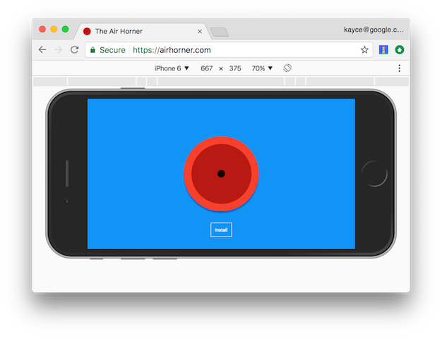
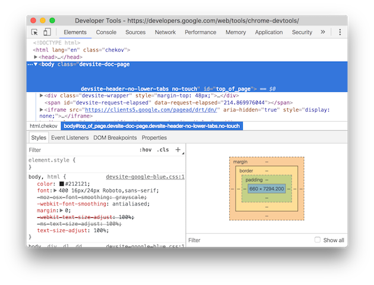
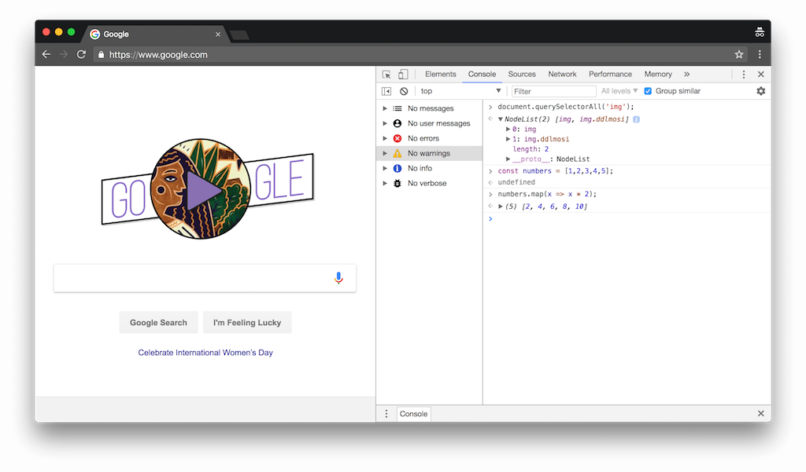
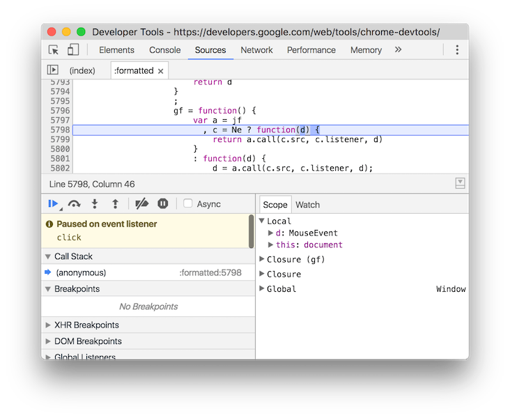
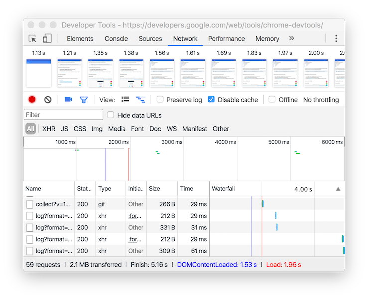
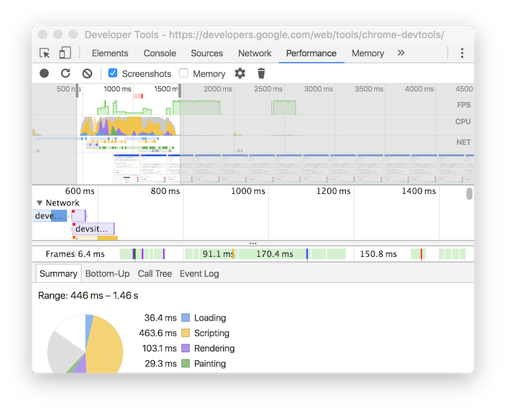
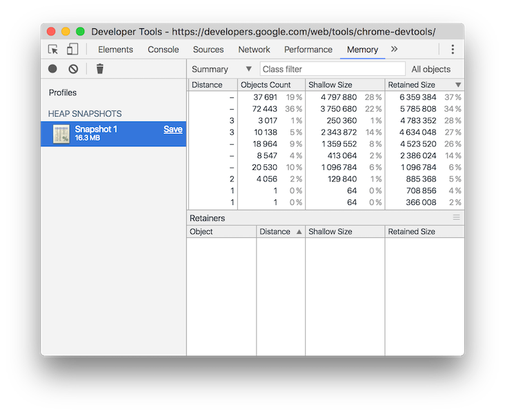
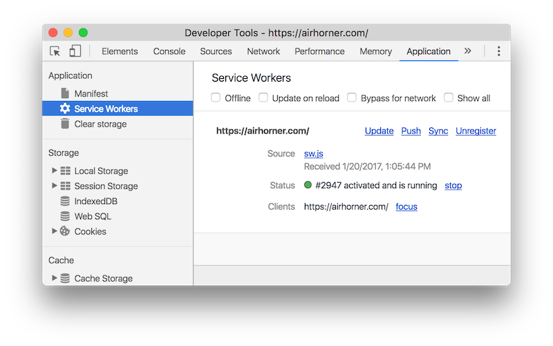
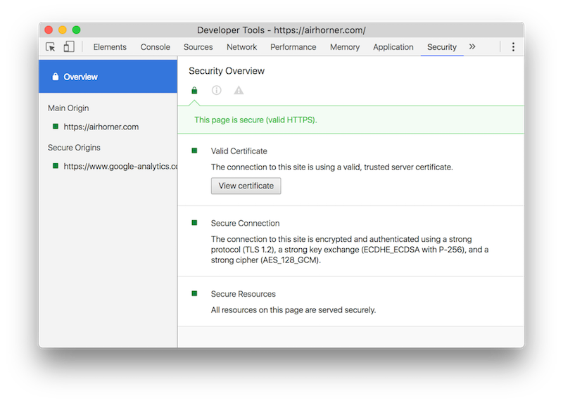

import { CodeSurfer } from "mdx-deck-code-surfer"
import { Notes, Appear } from 'mdx-deck'

import {WSlideMain, WSlide2, WSlide3, WSlide4, WSlide5, WSlideThankyou} from "../src/wizeline-theme/slides"
import {WLayout1, WLayout2} from '../src/wizeline-theme/layouts'

import Counter from '../src/components/Counter'
import Codepen from '../src/components/Codepen'

<WSlide3 title="Chrome DevTools" />
---

## What are the Google Chrome DevTools?

* The Google Chrome Developer Tools, also known as Chrome DevTools, are web authoring and debugging tools built right into the browser.
---

## What toos do we have?

* `Device Mode`
* `Elements panel`
* `Console panel`
* `Sources panel`
* `Network panel`
* `Performance panel`
* `Memory panel`
* `Application panel`

---
## Device Mode
``Simulate mobile devices``

<Notes>
Simulate mobile devices.
</Notes>
---
## Elements Panel

<Notes>
View and change the DOM and CSS.

</Notes>
---
## Console Panel

<Notes>
View messages and run JavaScript from the Console.
</Notes>
---
## Sources Panel

<Notes>
Debug JavaScript, persist changes made in DevTools across page reloads, 
save and run snippets of JavaScript, and save changes that you make in DevTools to disk.
</Notes>

---
## Network Panel

<Notes>
View and debug network activity.
</Notes>

---
## Performance Panel

<Notes>
Find ways to improve load and runtime performance.
</Notes>

---
## Memory Panel

<Notes>
Profile memory usage and track down leaks.

</Notes>
---
## Application Panel

<Notes>
Inspect all resources that are loaded, 
including IndexedDB or Web SQL databases, 
local and session storage, cookies, Application Cache, 
images, fonts, and stylesheets.
</Notes>

---
## Security Panel

<Notes>
Debug mixed content issues, certificate problems, and more
</Notes>
---
## Reference
https://developers.google.com/web/tools/chrome-devtools/#discover

<Notes>
open browser and play with the chrome devtools a bit
</Notes>
---

# example

<Notes>
open images example
</Notes>
