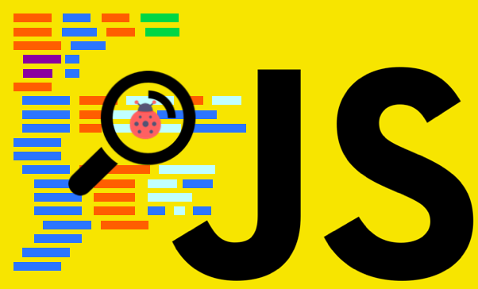

import { CodeSurfer } from "mdx-deck-code-surfer"
import { Notes, Image, Appear } from 'mdx-deck'

import {WSlideMain, WSlide2, WSlide3, WSlide4, WSlide5, WSlideThankyou} from "../src/wizeline-theme/slides"
import {WLayout1, WLayout2} from '../src/wizeline-theme/layouts'

import ImageGrid from '../src/components/ImageGrid'
import Codepen from '../src/components/Codepen'

<WSlide3
  title="Console and its many forms"
/>

---

<Notes>
javascript in our browser and how to debugit, our quick en dirty console
</Notes>
---
<CodeSurfer
  title="Console.log"
  code={require("!raw-loader!./snippets/console/00_log.js")}
  lang="javascript"
  showNumbers={false}
  dark={false}
/>
<Notes>
show issue where the vaule of the object has changed based on events passed
</Notes>
---
<CodeSurfer
  title="Console log format"
  code={require("!raw-loader!./snippets/console/01_format.js")}
  lang="javascript"
  showNumbers={false}
  dark={false}
  steps={[
    {range: [2,3]},
    {range: [2,6]},
    {lines: [19]},
    {range: [1,20]},
  ]}
/>
<Notes>
In the console.log() you can set 
%s for a string, 
%i and %d for numbers
%c for custom style.
You can probably find better ways to use this. If you use a single page framework, 
you maybe want to have one style for view message and another for models, collections, 
controllers and so on. Maybe also name the shorter like wlog, clog and mlog use your imagination!
</Notes>
---
<CodeSurfer
  title="Console table"
  code={require("!raw-loader!./snippets/console/02_table.js")}
  lang="javascript"
  showNumbers={false}
  dark={false}
/>
<Notes>
Table can help us view a lot of data in an array in a more organized way
</Notes>
---
<CodeSurfer
  title="Console Group"
  code={require("!raw-loader!./snippets/console/03_group.js")}
  lang="javascript"
  showNumbers={false}
  dark={false}
  steps={[
    {lines: [15]},
  ]}
/>
<Notes>
Group can also help us have data organized in an organized way and filter it,
groups can be nested
ask question, what do you think its going to happen when action is triggered?
</Notes>
---
<CodeSurfer
  title="Console Assert"
  code={require("!raw-loader!./snippets/console/04_assert.js")}
  lang="javascript"
  showNumbers={false}
  dark={false}
    steps={[
    {lines: [1]},
    {lines: [2]},
  ]}
/>
<Notes>
assert can help us console log output in a more elegant way
besides a if statement as it already has a condition
</Notes>
---
<CodeSurfer
  title="Console Count"
  code={require("!raw-loader!./snippets/console/05_count.js")}
  lang="javascript"
  showNumbers={false}
  dark={false}
    steps={[
    {lines: [8]},
  ]}
/>
<Notes>
If label is supplied, this function logs the number of times count() 
has been called with that particular label.

If label is omitted, the function logs the number of times count() 
has been called at this particular line.

</Notes>
---
<CodeSurfer
  title="Console Time"
  code={require("!raw-loader!./snippets/console/06_time.js")}
  lang="javascript"
  showNumbers={false}
  dark={false}
/>
<Notes>
Time calculates the time between the start and end of the commands,
these can be nested
</Notes>
---
<CodeSurfer
  title="Console Trace"
  code={require("!raw-loader!./snippets/console/07_trace.js")}
  lang="javascript"
  showNumbers={false}
  dark={false}
  steps={[
    {lines: [28]},
    {lines: [24]},
    {lines: [20]},
    {lines: [14]},
    {lines: [7]},
    {lines: [3]},
    {lines: [31]},
  ]}
/>
<Notes>
Trance goes from the top to bottom the top being the last call and the bottom is the origin
</Notes>

---

# Example
<Notes>
Open hamlet example
</Notes>