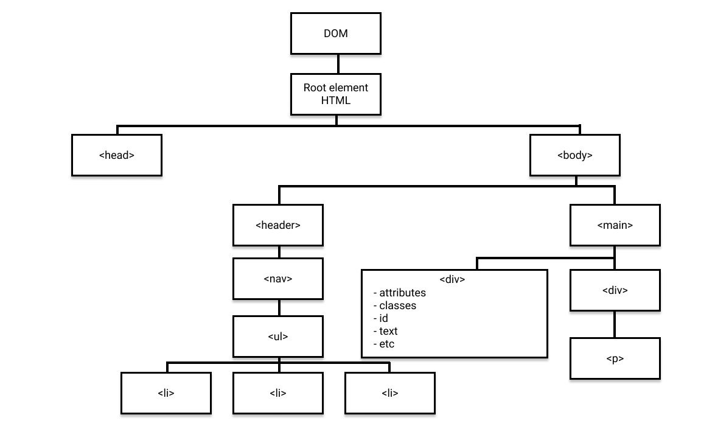

import { CodeSurfer } from "mdx-deck-code-surfer"
import { Notes, Appear } from 'mdx-deck'

import {WSlideMain, WSlide2, WSlide3, WSlide4, WSlide5, WSlideThankyou} from "../src/wizeline-theme/slides"
import {WLayout1, WLayout2} from '../src/wizeline-theme/layouts'

import Counter from '../src/components/Counter'
import Codepen from '../src/components/Codepen'

<WSlide3
  title="What's the DOM?"
/>

---

# Document Object Model
is a standard for how to get, change, add, or delete HTML elements
---

---
### DOM === HTML?
<Appear>
  <h1>DOM !== HTML</h1>
  
Browser fixes/changes bad formatted HTML code

  
JS & interactions can manipulate it

</Appear>
<Notes>

</Notes>
---

<WSlide3
  title="DOM manipulation"
/>
---

### Selecting existing elements

---
<Codepen url="https://codepen.io/ederdiaz/pen/zmVxgj"/>
---

### Creating new elements

---

<Codepen url="https://codepen.io/ederdiaz/pen/bmPdrq" />

---
# Recap
- document.createElement
- document.createTextNode
- element.innerHTML
- element.appendChild
- element.insertBefore
- element.nextSibling

---

# Excercise Time
---

<Codepen url="https://codepen.io/ederdiaz/pen/PyrqJG" />

---

# Modifying styles and classes

---

<Codepen url="https://codepen.io/ederdiaz/pen/gBNaYR" />

---

# Recap
- element.classList
- element.classList.add
- element.classList.remove
- element.classList.contains
- element.classList.toggle
- element.style
